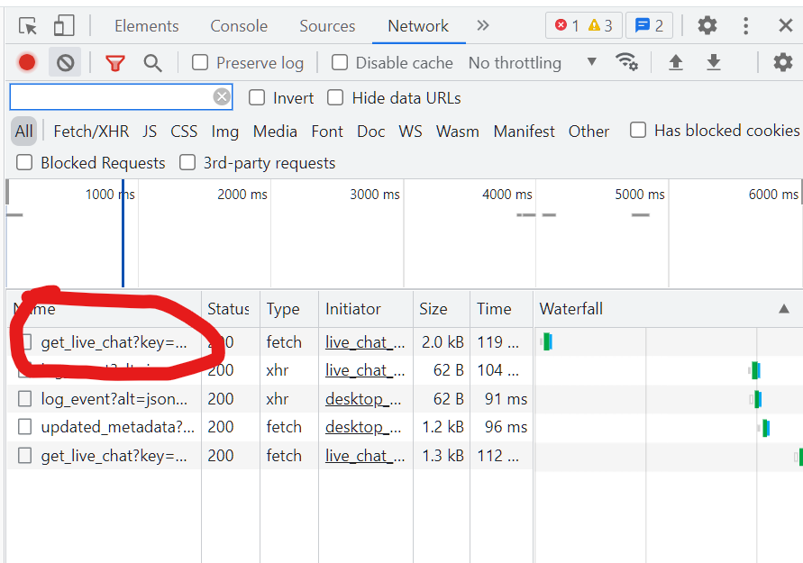
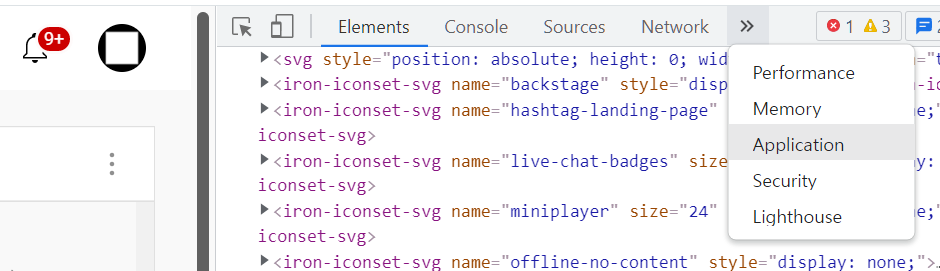

유튜브 쿠키 얻기
=

youtube.com의 쿠키를 얻는 방법을 알아봅니다.

사전 준비
-
* [youtube.com](https://www.youtube.com)에 로그인
* 우측 위 프로필을 눌러 현재 선택된 채널 확인 (보통 채팅봇 채널을 따로 사용하는 경우가 많습니다)
* 실시간 채팅을 1회 이상 접속합니다.

방법 1 : 개발자 도구 / Network
-

1. 실시간 채팅 화면에서 F12 또는 Ctrl+Shift+I를 눌러 **개발자 도구** 창을 열어주세요.

2. 상단 바에서 **Network 메뉴**를 선택해주세요.

3. `get_live_chat`으로 시작하는 것을 선택해주세요.

4. 아래로 내리면 `Request Headers` 안에 `cookie:` 라는 값이 있습니다. 이 값을 통으로 드래그하여 복사해주세요. (`cookie:` 제외)

5. Jytchat 앱의 '모든 쿠키 한번에 입력하기'에 붙여넣기한 후 '저장 및 닫기' 버튼을 눌러주세요.

방법 2 : 개발자 도구 / Application
-

1. 실시간 채팅 화면에서 F12 또는 Ctrl+Shift+I를 눌러 **개발자 도구** 창을 열어주세요.

2. 상단 바에서 **Application 메뉴**를 선택해주세요.

3. 왼쪽 메뉴에서 **Cookies -> https://www.youtube.com** 메뉴를 선택해주세요.

4. 필요한 쿠키를 찾고 값을 복사하여 Jytchat 앱에 입력합니다.

방법 3 : 쿠키 설정
-

1. 주소창 좌측 위 **🔒자물쇠 또는 ℹ정보 아이콘 -> 🍪쿠키**를 눌러주세요.

2. **youtube.com -> 쿠키**를 펼쳐주세요.

3. 필요한 쿠키를 클릭하고 아래의 **콘텐츠** 값을 복사하여 Jytchat 앱에 입력합니다.